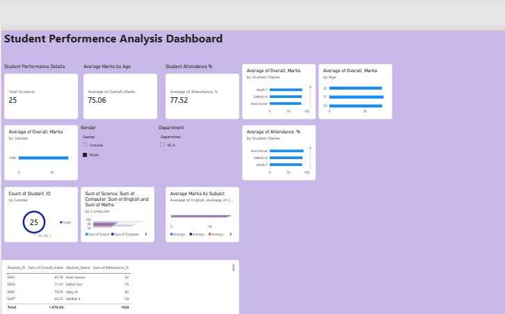

# Student Performance Analysis Dashboard

## Project Overview
An interactive Power BI dashboard designed to analyze student performance using attendance, subject marks, and overall performance metrics.

## Tools Used
- Power BI
- Microsoft Excel
- SQL

## Key Features
- Total student count
- Average overall marks
- Average attendance
- Subject-wise performance
- Gender-wise performance
- Student attendance analysis
- Interactive filters and slicers
- Student performance details

## Files
- Students Performance.xlsx – Dataset
- Student Data.pbix – Power BI dashboard

## Dashboard
The dashboard provides interactive visualizations to identify student performance trends and analyze academic data.
## Dashboard Preview

## Live Dashboard

## Live Dashboard

[View Power BI Dashboard](https://app.powerbi.com/links/FpL7u-sQlP?ctid=406a6e9a-2c6d-4cd4-b5fc-299c924534e7&pbi_source=linkShare&bookmarkGuid=5abd0e68-bc96-45b4-9dd2-12b1a0d6ac96)
